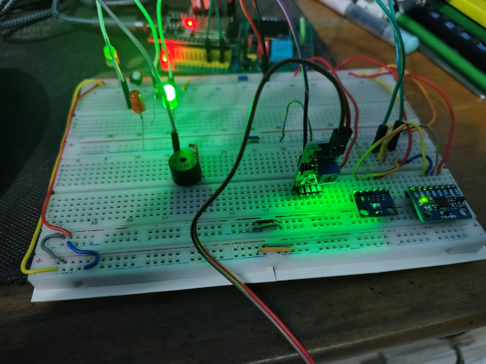
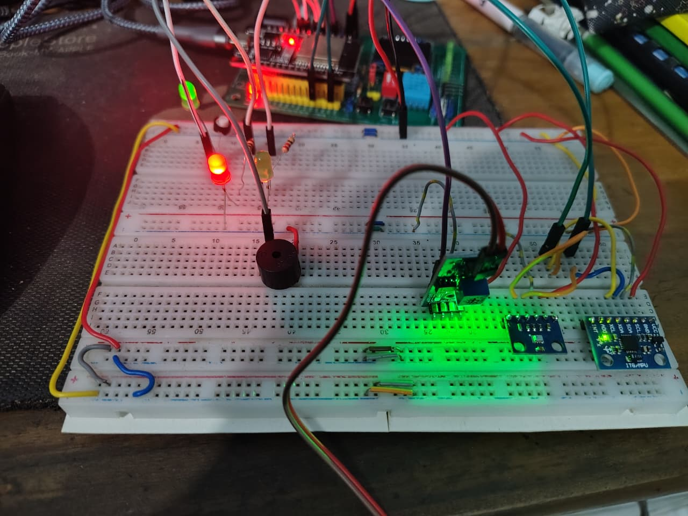
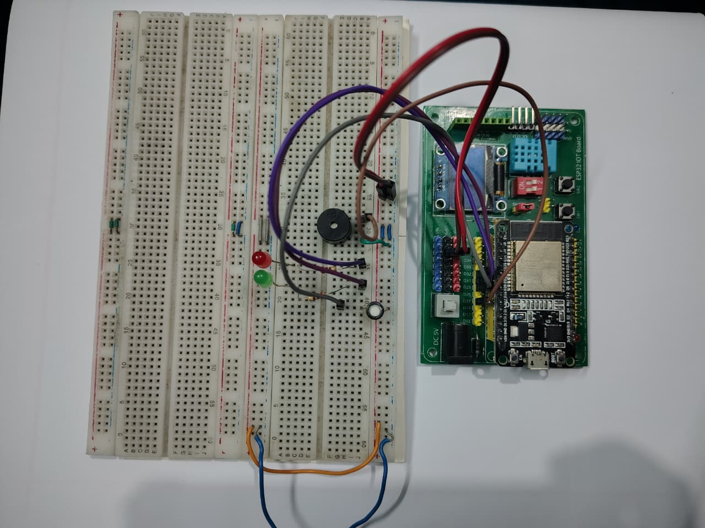
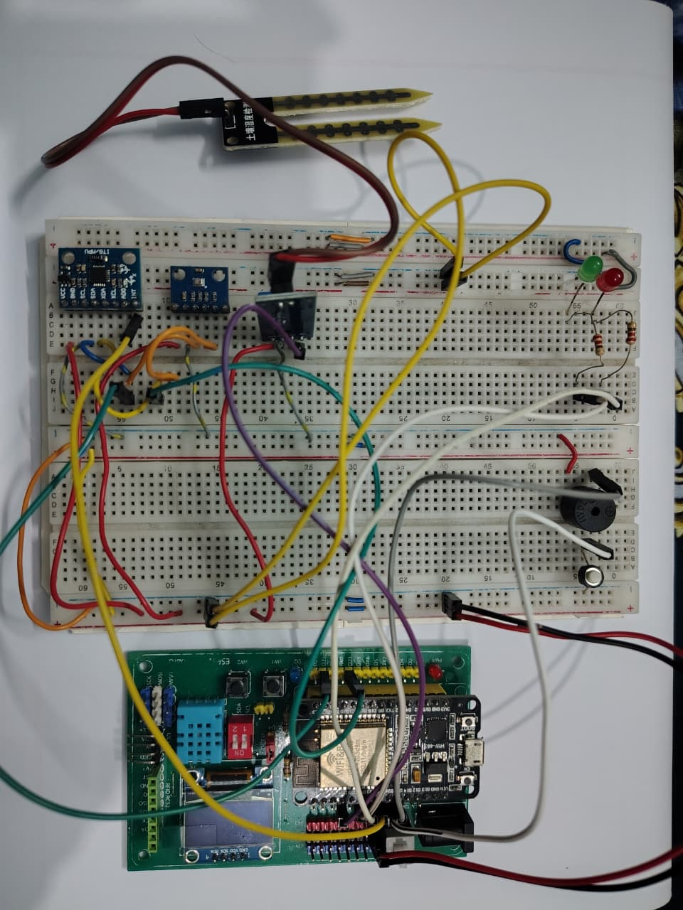
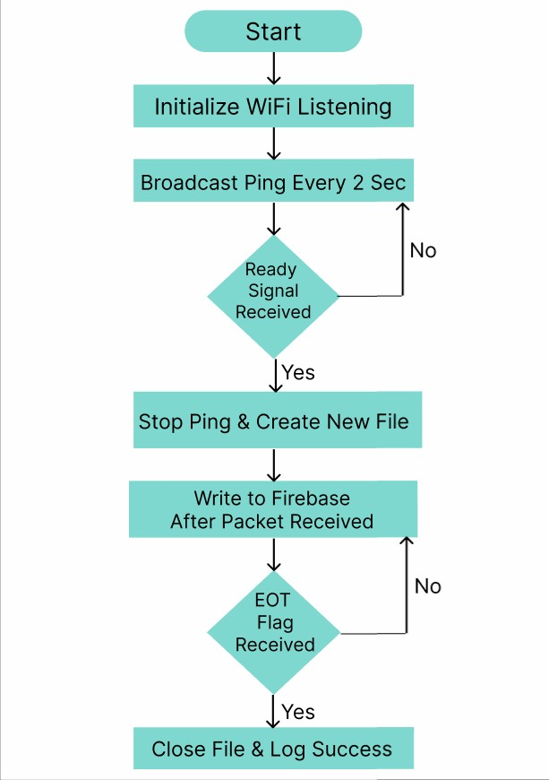
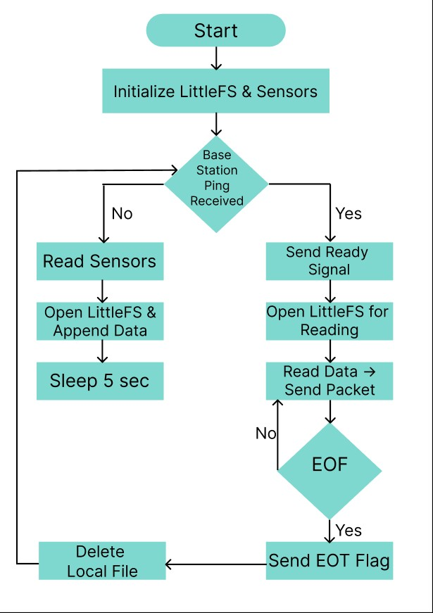
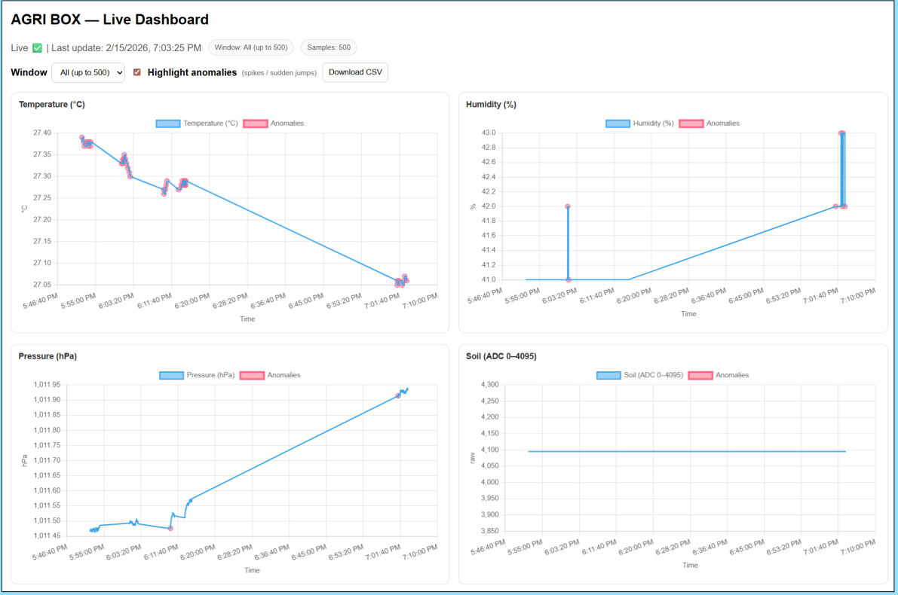

# The AGRI BOX (IoT Data Logger with Wireless Sync)

---

## 1. Problem
Environmental monitoring in remote agricultural or forest areas is difficult due to the lack of internet connectivity. Conventional IoT systems rely on continuous 
WiFi or cellular networks, making them unsuitable for “dead zones.” This leads to gaps in data collection, delayed insights, and reduced ability to make informed 
decisions regarding crop health and environmental conditions.

---

## 2. Proposed Solution
AGRI BOX introduces an offline-first IoT data logging system using a store-and-forward architecture. A field-deployed Logger Station continuously collects and 
stores environmental data locally. A mobile Base Station is later used to wirelessly retrieve this data and upload it to a cloud database. This approach ensures 
reliable data collection without requiring constant connectivity.

---

## 3. Key Components

- ESP32 Dev Boards (x2) – Core controllers for Logger and Base Station  

### 3.1 Sensors
- BMP280 – Temperature & Pressure  
- DHT11 – Humidity  
- Soil Moisture Sensor – Soil condition  
- GY-521 – Fall detection  

### 3.2 System Components
- Storage: ESP32 Internal Flash (LittleFS)  
- Communication: WiFi (local device-to-device)  
- Indicators: LEDs, Buzzer, OLED Display  

  
  

  <b>Figure 1:</b> Green LED (Normal Operation) & Red LED (Error/Alert State)

- Power Source: Power Bank (for field deployment)  
- Cloud: Firebase Realtime Database  
- Interface: Web Dashboard  

  
  

  <b>Figure 2:</b> Base Station (Left) & Logger Station (Right)

---

## 4. Operation

### 4.1 Offline Logging (Logger Station)
- Periodically wakes from deep sleep  
- Reads sensor data  
- Stores data locally in CSV format  

### 4.2 Synchronization (Base Station)
- Base continuously broadcasts a “PING”  
- Logger responds when in range  

### 4.3 Data Transfer
- Logger sends stored data in packets via WiFi  
- Base receives and forwards it to the database  

### 4.4 Completion
- Logger deletes transmitted data to free storage  
- System resumes normal operation  

  
  

  <b>Figure 3:</b> Base Station Logic (Left) & Logger Station Logic (Right)

---

## 5. Database
The system uses Firebase Realtime Database to store collected data.  

- Data is uploaded instantly after synchronization  
- Structured in timestamped entries  
- Supports real-time updates  
- Enables seamless integration with frontend applications  

---

## 6. Dashboard
A dynamic web dashboard provides visualization of collected data:

- Real-time graph updates after each sync  
- Displays temperature, humidity, pressure, and soil moisture  
- Organized with timestamps for historical tracking  
- Runs locally and pulls data directly from Firebase  

  

  <b>Figure 4:</b> Web Dashboard Visualization

---

## 7. Challenges
- Ensuring reliable wireless communication without internet  
- Managing limited onboard storage efficiently (LittleFS)  
- Synchronizing data transfer without packet loss  
- Power optimization using deep sleep cycles  
- Handling edge cases like fall detection and system errors  
- Designing a user-friendly yet lightweight dashboard  

---

## 8. Documentation

For a more detailed explanation, please refer to the [Agri_Box_Report.pdf] (./Agri_Box_Report.pdf)

